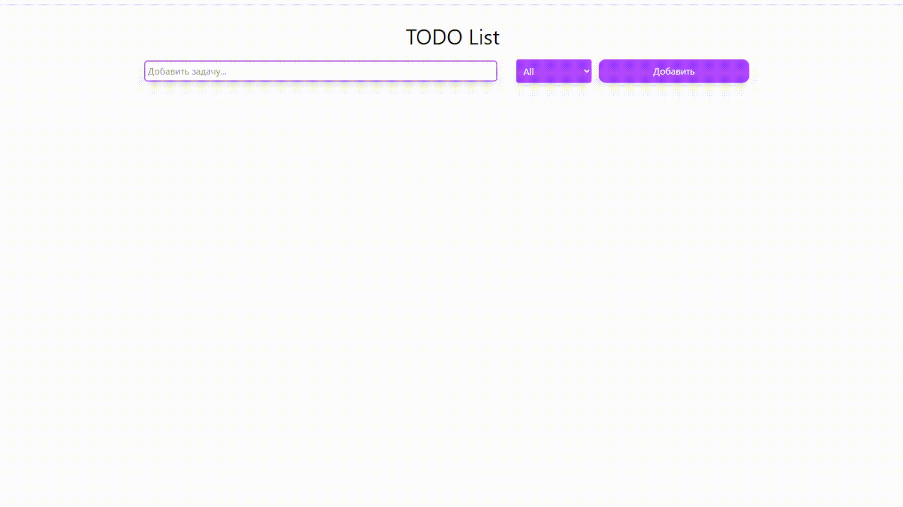

# ToDo App with Vue

Мини-приложение ToDo, созданное на Vue 3 и оформленное с использованием TailwindCSS.



##  Основные возможности
- Добавление задач
- Отметка задач как выполненных
- Удаление задач
- Редактирование задач
- Фильтрация

##  Использованные технологии
- Vue 3
- Vite
- TailwindCSS
- Composition API
- Pinia

##  Установка и запуск
```bash
git clone https://github.com/silius124/ToDo-App-with-Vue.git
cd ToDo-App-with-Vue
npm install
npm run dev  # или 'npm run serve'
